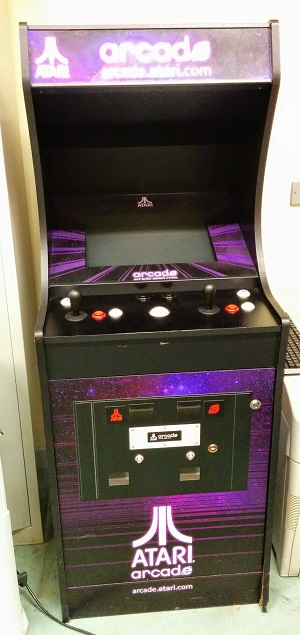
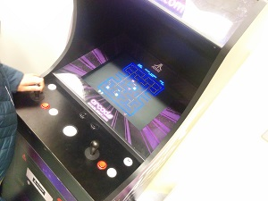

# Object Oriented Programming Assignments 2014/2015

## Assignment 2

Create a retro-style game to run on this beautiful arcade cabinet. 

 

If you need inspiration, check out:

[Vector arcade games on Wikipedia](http://en.wikipedia.org/wiki/Category:Vector_arcade_games)
[Vectrex games](http://en.wikipedia.org/wiki/Category:Vectrex_games)

Also consider downloading [MAME](http://mamedev.org/) and playing some retro games.

I want to bring the cabinet to the State of Play festival and the Project fair with all of your games running on it. You will be able to select the game to play from a menu of all your games. That way 100's of people will see and play your games.  The rules:

- You must include a splash screen with instructions, game screen(s) and a game over screen
- You must write all the code yourself, though you can take code from the example projects we made in the class. If you use code we developed in the class, you must modify it substantially yourself.
- You should make all the art yourself. I suggest you procedurally draw everything to make a vector graphics style game. 
- If you are good at drawing, you can make your own sprites as an alternative to procedurally drawing everything
- Keep in mind the theme for this years Games Fleadh is "Endless Runner" so you might want to make one of these and enter it into Games Fleadh too!
- You can use the keyboard or mouse to control your game. I haven't figured out how to reprogram the controllers on the arcade cabinet yet, so you should start with the starter code, which loads the keyboard bindings from a properties file. 
- You should try and use git to manage your source code for the project and submit a link to your git repo. I will look at your git logs to see how much time you have spend on this assignment.
- You should spend at least 2 full days on the assignment.
- The assignment is due to be demoed in the lab the week of 19 January.

Alternatively! You can form a team to do an Imagine Cup project, however the rubrick below aplies regardless of what project you decide to do.

Marks:

Code: 30%
Gameplay:30%
Project management: 20%
Visuals: 20%

Rubric

| Grade | Description |
| ------|-------------|
| First | A project that looks great. All the art and is 100% procedural or self drawn and looks beautiful. There a significant amount of clever animation or gameplay (if the project is a game). For example multiple "modes" or "screens". The assignment has lots of functionality. There is depth to the gameplay. For example, progression and powerups. The code is organised into classes that make use of inheritance and polymorphism. There is a lot of novelty and originality. All the code is written by the you. You will have used PVectors, transforms and classes to create autonomous elements in the assignment. You will loading content from text files. You will have used git extensively. Everything works. Example: A twin stick shooter|
| 2.1 | The project looks good. There is a some animation or gameplay. You put in a good effort. Some features may not be complete or entirely working. Probably no file IO, but there should be while loops, for loops if statements etc to control aspects of the assignment. You have used classes, but possibly not inheritance and polymorphism. Maybe used git to do one or two commits. Example: A simple space shooter. |
| 2.2 | The project looks so so, but is pretty basic. There should be some animation or gameplay but significant issues that you couldn't resolve. You may have used sprites instead of drawing everything. All the movement and animation code will be pretty basic for example colours changing each frame or movement controlled by variables that just update each frame. Little or no control code. There is not much code, maybe a page or two. Example: A basic Pong game |
| Pass | All code in one file. Around a hundred lines of code. Looks like it could have been completed in an hour or two. Mostly drawing code, little or no controling code. Little or no functionality. Lots of code acquired from other sources. Example: An incomplete Pong game|
| Fail | Something very basic that looks like it could have been completed in an hour. Just drawing code, no control code. The assignment has no interactivity. Significant unaddressed technical problems  |

## Assignment 1
Use the skills you are learning on the course to create a version of this game in Processing:

Your game must include the following features:
- A splash screen, game screen and game over screen
- Player left and right movement
- Black blocks that fall from the top of the screen. If the player collides with one of the black blocks, they will loose a life. These should have random x positions. Ideally these should be evenly spaced
- When the number of lives goes to 0, it is game over.
- Random red blocks. If the player collides with one of these, they should gain a point.
- The game should speed up hence becoming more difficult as it goes on.

You should use the following features of Processing
- Variables, arrays
- Classes
- Loops
- Drawing primitives
- The if statement
- User input

Marking scheme:
- 50% of the marks for this assignment are for implementing the core game as presented in the video
- To get the remaining 50% of the marks you have to come up with your own additions to te core game. Some suggestions:
	- Power up blocks that speed up or slow down the gameplay
	- Extra life blocks
	- Additional gameplay. For example, the ability to shoot blocks
	- Sprites and nice graphics and sound
	- Running on an Android Phone or Raspberry Pi
	- Control with a Kinect, XBOX Controller or Leap Motion
	- Different types of block behaviours instead of just falling 
	- Any other crazy ideas you can come up with your self

Rules!

- As much as possible this project should be 100% your own code. You will not get any marks for any code that include that you get from books or from the internet. This assignment is about testing what *you* have learned and what *you* can do.
- Any suspected plagorism will be dealt with according to DIT General Assessment Regulations. This could mean expulsion from DIT. I will personally grade all assignments.
- There will be a feedback session after the assignment where you will have the opportunity to get individual feedback on your submissiona and have your mark explained to you.
- All assignments should be submitted through Google Classroom. Go to http://classroom.google.com and register using the code: codymp
- The date for submission is Tuesday 4 November @ 4pm. 
- All assignment submissions must be demoed in the lab that week.
- If you need to submit an assignment late, you must submit a PC/1 form to the exams office.
