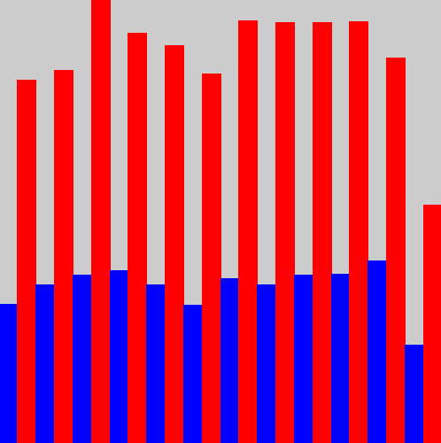
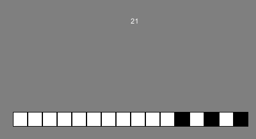
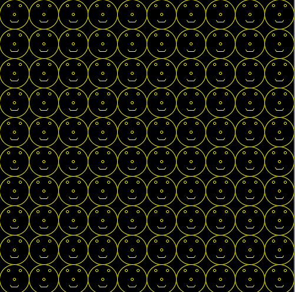
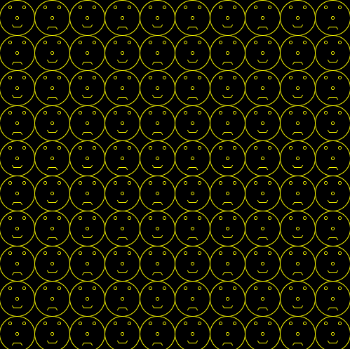

OOP Programming Labs
====================

Lab 11
------

Watch [this video](https://www.youtube.com/watch?v=p_PGUltnB6w) which explains the fundamentals of using git. Also at some stage you *need* to read the [first three chapters of the git manual](http://git-scm.com/documentation).

- Create a [github](http://github.com) account if you dont already have one. You can sign up using whatever email address you want and then [link your DIT email address to the account using this link](https://education.github.com/discount_requests/new) to get access to free private repositories.
- Sign in to your github account and then click [here to go to the repository for the starter code for the Christmas assignment](https://github.com/skooter500/Assignment2StarterCode).
- Click the fork button to make a fork of the assignment code in your own github account. After a few seconds you will have your own fork of the code. To read more about forking and what it means see [this link](https://help.github.com/articles/fork-a-repo/).
- Now start gig bash on your computer and type:

	```
	git clone https://github.com/YOUR-GIT-USERNAME/Assignment2StarterCode
	```
- Replace YOUR-GIT-USERNAME in the above with your git username. A clone is a local copy of a git repository from a server that you can work on.
- Type:

	```
	cd Assignment2StarterCode
	ls
	```
- To change directory and do a directory listing of the folder with the starter code in it.
- Now go and load the sketch into Processing and run it.
- Edit the sketch and save your changes.
- Go back to git bash and type:

	```
	pwd
	```
- Which means print working directory and verify that you are in the correct directory for your sketch.
- Type:
	```
	git add . 
	git commit -m "A message to go here"
	git push
	```

Lab 10
------
We did some work on this in the class yesterday, so you can start with the [code we worked on](../Processing Examples/SpaceWarsWIP).

To complete this lab:

- Add a field to the ```Player``` class called ```fireRate```. This field controls how often the player can fire. For example, setting this to be 5 means the player can fire 5 bulets per second.
- Only allow the player to fire at the fire rate. I want you to figure out how to do this yourself, but consider that Processing updates the screen 60 times per second, so you know that 1/60 of a second has ellapsed whenever the ```Update``` method gets called.
- Allow bullets to wrap around the screen. In other words, when a bullet goes off the left side of the screen, it reappears on the right side of the screen, travelling at the same velocity.
- Allow bullets to stay alive for 5 seconds and then get removed from the game.
- Use encapsulation as much as possible in your solution. In other words, bullets should look after themselves!

Bonus:
Give the player a lives field and decrement this whenever a bullet hits the player. The bullet should also get removed from the game when this happens.

When you have completed the above, logon to webcourses. Click Content and answer the MCQ questions for this lab. This will become available at 5pm and become unavailable at 6:30pm.

Lab 9
-----
Be sure you know how inheritance, polymorphism and the [ArrayList](https://www.processing.org/reference/ArrayList.html) works in Processing! Google these if you need to

The aim of this lab is to give the ships the ability to shoot bullets.

- Get the SpaceWarsWIP sketch we were working on in class on Monday as starter code for this or use your own code from the class.
- Refactor the sketch to use an ```ArrayList``` of ```GameObject``` types instead of using an ordinary array. An ```ArrayList``` can grow and shrink, which is useful because it means we can add and remove things from the screen easily.
- Modify the ```Bullet``` class so that it moves. Look at the ```Player``` class for an example of how this can be done. You could use add a ```speed``` variable to control the speed of movement.
- Make it so that when the player presses the SPACE key, you create a new ```Bullet``` instance and add it to the ```ArrayList``` of GameObjects in the main sketch
- Test all of this to make sure your sketch works!
- Now see if you can figure out how to limit the bullet fire rate to 5 bullets per second. Hint: Processing is calling your draw method 60 times a second.
- Finally see if you can figure out how to get the Bullet's instances removed from the list when they go outside the bounds of the screen. I like to do this by:
	-  Adding a boolean field called ```alive``` to the base class ```GameObject```. 
	-  Setting this to be ```true``` in the constructor
	-  In the Bullet ```move``` method, setting ```alive``` to be ```false``` if the x and y are ourside the bounds of the screen
	-  In the sketch update method, iterating through all the ```GameObject```s and removing those whose alive flag is set to be ```false```.


Lab 8
-----

### Part 1

Take 5 minutes to give me your feedback by filling out [this short feedback form](https://docs.google.com/forms/d/1EMmLeWM7ZLCP9Pvndc5YwPcixYHCnaMgHzEQc6-XQZE/viewform) on the assignment you just did.

You an use the [code we worked on in the class](../Processing Examples/SpaceWarsWIP) to start this lab. The aim of this lab is to make a class called Bug that draws this bug:


You should add the following fields:
- x and y
- size

Add the following methods:
- A default and a parameterised constructor
- A draw method

In the draw method, you should draw the bug shape using lines. The x and y fields represent the centre of the bug while the size controls the width and height of the bug (it should fit into a square). You should calculate everything relative to the size. In other words changing the size field should draw the bug bigger or smaller.

Create several instances of the bug in the sketch to test to see if it works.

### Part 2
Finish off the star class!

Lab 7
-----

Form a team, branstorm an idea and [enter the Appcademy](http://www.theappys.ie/). Do it now!

Study the [code we wrote in the class yesterday](../Processing Examples/SpaceWarsWIP) very carefully and use it as starter code for this lab. Ive added calls to ```pushMatrix``` and ```popMatrix``` to the ```draw``` method of the ```Player``` class. We will discuss these on Friday.

Be sure you know how to make a class in Processing. Read the documentation and watch the videos if necessary. To complete this lab you also need to know:
- How classes and objects work
- How fields and methods work
- How constructors work
- How ```translate``` and ```rotate``` works.
- How the right angled triangle works
- How the unit circle works
- How radians work

The aim of this lab is to make a Star class. It should have the following fields:
- points - A float giving the number of points on the star
- radius - The radius of the star

The "depth" of the points should be half the radius.

Your star class should have the following methods:

- Default and paramaterised constructors 
- A draw method. You should draw the star procedurally. I.e. calculate the points using code.

Bonus!
- Add an additional field theta that controlls the rotation of the star.

Lab 6
-----
Use the [implementation of the Game of Life we wrote in the class yesterday](../Processing Examples/Life) as a starting point for this lab. It has a bug that means the simultaion will not evolve as it should. To figure out the bug, work out what should happen to the following cells:


If you figure out the bug and fix it, you can test your game of life by making make this shape:


It should evolve for hundreds of generations, spawning creatures and consuming itself over and over again. Here is a youtube video of my version in Processing:

[](http://www.youtube.com/watch?v=z4NAyrGJC5s)

You can check for key presses in your Processing sketches in several ways. One of them is given below:

~~~Java
if (keyPressed)
{
  // Check to see if the q key was pressed
  if (key == 'q')
  {
    println("Q");
  }
  ...
  ...
~~~

Using this method see if you can implement the following features:
- The ability to slow down and speed up your Game of Life. You can use the fact that the ```draw``` method is called 60 times a second to achieve this. You could also make use of the ```frameCount``` variable in Processing. Look it up if you are not sure what it does.
- The ability to pause and unpause the sketch if you press the SPACE key.
- The ability to clear the board if you press C and randomise the board if you press R.
- The ability to draw cells onto the board with the mouse. You can use the ```mousePressed``` method and the ```mouseX``` and ```mouseY``` variables in Processing to achieve this.
- The ability to spawn creatures if you press the number keys. You can see the types of creatures you could spawn in the [Wikipedia article about the Game of Life](http://en.wikipedia.org/wiki/Conway's_Game_of_Life).

Lab 5
-----
In this lab, you will be taking the sketch and the data we worked on in the class yesterday and creating a sketch that generates this bar chart of monthly Android and IOS music searches:



Note that Android searches are plotted in blue and IOS searches are plotted in red. The dataset that we used gives the number of queries by day so the first thing we need to do is get the total number of queries each month. Here is what I suggest you do (but fee free to ignore this and come up with your own solution):

- Create a new global array called ```daysInMonth``` that holds the number of days in each month. Use constant initialisation to set the values in this array. For example:

	```Java
	/// Create an array with 4 elements initialised with values
	int[] array = {10,20,30,40};
	```

- Create arrays for ```androidByMonth``` and ```iosByMonth``` to hold the total number of android and ios queries each month. These will have 12 elements each. One element for each month.
- In the loadData method as you are reading in the data for each day from the file figure out a way to load the data into the ```androidByMonth``` and ```iosByMonth``` arrays also. You will have to use the array ```daysInMonth``` you made earlier to help you do this.
- In the draw method, figure out the maximum value of the ```iosByMonth``` array. You can use this to scale the bars so that the tallest bar fits the height of the screen. You can make a variable ```scaleFactor = (float) height / maxIos```.
- Iterate through the arrays and draw the barchart. Make the barchart fit the width of the screen. There will be 24 bars, so the width of each bar will be ```width / 24.0f```. You should use a float to store this value.
- Use rect to draw the bars. Remember the parameters are x, y, rectWidth and rectHeight. You can specify a negative number for rectHeight to get the bar to draw upwards.

### Bonus!
- Draw a pie chart of Android vs IOS queries.

Lab 4
-----
For this lab you will be making a sketch that allows the user to convert between binary and decimal using a graphical tool that looks like this:



The user should be able to click any one of the squares to "toggle" a bit on or off. The number in decimal should automatically change. For example, in the screenshot above, bits 0, 2 and 4 are turned on so the number is 1 + 4 + 16 = 21. 

To complete the sketch you can use a boolean array. Remember arrays from first year? Arrays are a  collection of data all of the same type. Read  [this article that explians how arrays work in Processing](http://www.processing.org/reference/Array.html). A boolean array is just an array where every element is either trur or false.

Here is a skeleton sketch to get you started if you need it, but *feel free to ignore this and just come up with your own solution*:

~~~Java
boolean[] bytes = new boolean[16];
int centX, centY;

// Probably need to declare some more variables here


void setup()
{
  size(500, 500);
  centX = width / 2;
  centY = height / 2;  
  
<<<<<<< HEAD
  // And set their values here
=======
  // And set their valuse here
>>>>>>> binaryNums
}


void draw()
{
  background(127);
  // Do some stuff here
  
  int number = binaryToDecimal(bytes);
  // This is how you print text in Processing
  fill(255);
  text(number, centX, 100);
}

int binaryToDecimal(boolean[] bytes)
{
  int ret = 0;
  
<<<<<<< HEAD
  // Implement this method
=======
  // Implement this function
>>>>>>> binaryNums
  
  return ret;
}

void mousePressed()
{
  // Put some code here too
  // To toggle the bit on or off based on the mouse position.
}
~~~

What I suggest you do is:

- Implement the method ```int binaryToDecimal(boolean[] bytes)```. 
- Set some of the bits in the bits array to be true and test the method you wrote by printing out the value.
- Write code in the ```draw()``` method to draw boxes to represent the bits. The box should be black only if the appropriate bit is true.
- Write code in the ```mousePressed()``` method to calculate which if any box the user has pressed the mouse onto and toggle the appropriate bit.

### Bonus!
- Print the bit numbers over the boxes
- Implement 2's complement.
- Colours! Lights! Animations!

Lab 3
-----
Check out the example Spiral skeches and the various examples we made in the class on Monday. Use loops to recreate some of [these geometric patterns from everyday life](https://plus.google.com/u/1/photos/102641008582291248101/albums/6064398604152239873). 

Try and choose at least one image that uses just loops and at least one image that uses some trigonometry. Upload your examples through webcourses. I will award a prize for the most beautiful geometric patternms in Friday's tutorial class.

Lab 2
-----
### Part 1

Make a rollover button in Processing. The button should be centred on the window and take up 30% of the width and height of the window. When you roll the mouse over the button, it should change colour from grey to blue:
Advanced! Make the button into a toggle (click on/click off) button. The button should go red when it is toggled on. In order to do this, you need to make use of the following method in your sketch:

~~~Java
void mousePressed()
~~~

This method will get called by the Processing framework whenever the mouse in pressed in the window where your sketch is running. Here is a youtube video with the completed sketch:

<a href="http://www.youtube.com/watch?feature=player_embedded&v=YGlGRnQoDFY
" target="_blank"></a>

### Part 2
Implement a bouncing ball. It should move diagonally in your sketch and "bounce" off the walls.

Lab 1
-----

Take the time to look up the following methods in the [Processing language reference](http://processing.org/reference/ ) to make sure you are clear about the syntax and parameters:

* line
* ellipse
* rect
* background
* stroke
* fill
* size

The first thing you need to do is complete the processing sketch we were working on in the class. Here are two shapes you can draw:


Try experimenting with colours!

Now try and figure out how to procedurally draw these patterns:


(Use variables as much as possible and use a loop in your solution)

Now try this one:



Finally try this one:



Notice the mouths

Feel free to experiment with colour!  
